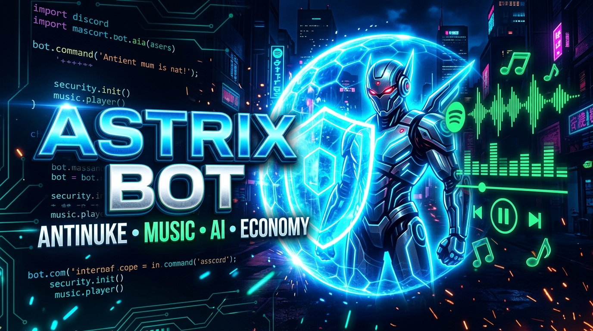
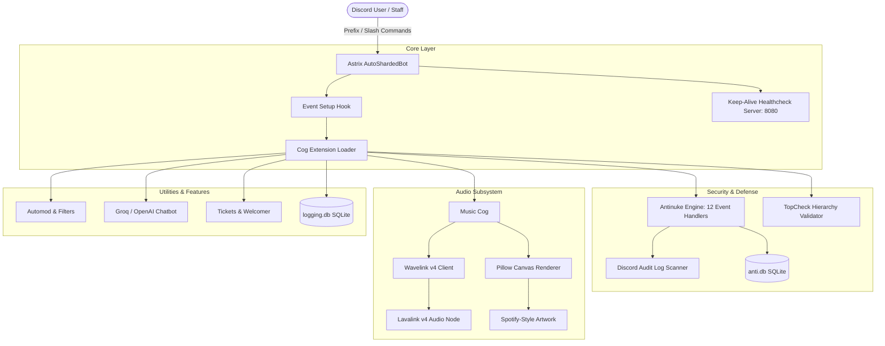

<div align="center">

# ⚡ ASTRIX BOT ⚡
### *Next-Generation Multipurpose Discord Bot • Antinuke Security • Spotify-Style Music • AI-Powered Automod*

<p align="center">
  
</p>

[](https://python.org)
[](https://discordpy.readthedocs.io)
[](https://wavelink.dev)
[](https://sqlite.org)
[](LICENSE)

[](https://github.com/Extremez-Surya)
[](https://www.youtube.com/@ASTRIXCODE)
[](https://discord.gg/FR9pXG2Mwb)

<br/><br/>

<p align="center">
  
</p>


<p align="center">
  <b>Developed with passion by <a href="https://github.com/Extremez-Surya">Vinay Kumar (ASTRIXCODE)</a></b><br>
  <i>Built for performance, aesthetic Component V2 UI, and server defense.</i>
</p>

</div>

---

## 📑 Table of Contents
- [🌟 Key Highlights](#-key-highlights)
- [✨ Core Feature Modules](#-core-feature-modules)
  - [🛡️ 1. Ultra Antinuke & Defense System](#️-1-ultra-antinuke--defense-system)
  - [🎵 2. Audiophile Music & Spotify Canvas Engine](#-2-audiophile-music--spotify-canvas-engine)
  - [🔨 3. Advanced Moderation & TopCheck](#-3-advanced-moderation--topcheck)
  - [🤖 4. AI Chatbot & Prodia Imagine](#-4-ai-chatbot--prodia-imagine)
  - [⚙️ 5. Automated Server Utilities & Management](#️-5-automated-server-utilities--management)
  - [🎮 6. Interactive Games & Economy](#-6-interactive-games--economy)
- [🏗️ Project Architecture](#️-project-architecture)
- [📁 Repository Structure](#-repository-structure)
- [🚀 Quickstart & Installation](#-quickstart--installation)
  - [Prerequisites](#prerequisites)
  - [Setup Guide](#setup-guide)
  - [Environment Variables (.env)](#environment-variables-env)
- [⚙️ Configuration Files](#️-configuration-files)
- [👑 Author & Credits](#-author--credits)

---

## 🌟 Key Highlights

<table>
  <tr>
    <td width="50%">
      <h3>🛡️ Enterprise Antinuke Security</h3>
      <ul>
        <li>Sub-millisecond audit-log evaluation</li>
        <li>12+ protective attack hooks (kick, ban, channel/role changes, webhooks)</li>
        <li>Multi-tier whitelist, extra-owners, and instant server lockdown</li>
        <li>TopCheck hierarchy shield preventing mod-on-admin exploitation</li>
      </ul>
    </td>
    <td width="50%">
      <h3>🎵 Spotify-Theme Canvas Music</h3>
      <ul>
        <li>Dynamic PIL image generation with clean dark Spotify gradient cards</li>
        <li>Wavelink 4.0 + Lavalink v4 for crystal-clear loss-free audio</li>
        <li>15-button full-featured interactive controller view</li>
        <li>In-place container editing — zero spam when songs switch</li>
      </ul>
    </td>
  </tr>
  <tr>
    <td width="50%">
      <h3>🤖 AI Intelligence & Auto-Moderation</h3>
      <ul>
        <li>Groq / OpenAI Mixtral LLM integration for conversational chatbot</li>
        <li>Automated spam, invite link, caps, mass-mention, and bad-word filters</li>
        <li>Prodia AI art generation directly inside Discord channels</li>
        <li>Multi-engine translator supporting 100+ global languages</li>
      </ul>
    </td>
    <td width="50%">
      <h3>🎨 Modern Component V2 Architecture</h3>
      <ul>
        <li>Native Discord Components V2: LayoutView, Containers & TextDisplays</li>
        <li>4-Tab comprehensive interactive System Stats Dashboard</li>
        <li>Full Welcomer, FastGreet, Ticket & Giveaway management suites</li>
        <li>Sharded asynchronous event processing powered by Discord.py 2.7</li>
      </ul>
    </td>
  </tr>
</table>


---

## ✨ Core Feature Modules

### 🛡️ 1. Ultra Antinuke & Defense System
Astrix safeguards your community against rogue administrators, compromised accounts, and token raiders.

- **Automated Event Interceptors**:
  - `antiban.py` & `antikick.py`: Auto-bans any unauthorized member attempting mass user expulsions.
  - `antichcr.py`, `antichdl.py`, `antichup.py`: Guards channels against spam creation, deletion, or title/permission modification.
  - `antirlcr.py`, `antirldl.py`, `antirlup.py`: Prevents malicious role destruction or hierarchy escalation.
  - `antibotadd.py`: Automatically kicks/bans unauthorized bots invited by non-whitelisted members.
  - `antieveryone.py`: Detects and neutralizes illicit `@everyone` / `@here` mass pings.
  - `antiwebhookcr.py` & `antiwebhookdl.py`: Blocks spam webhook creation and unauthorized payload execution.
  - `antiprune.py` & `antiguild.py`: Guards against guild ownership disruption, vanity hijacking, or mass prunes.
- **Granular Privilege Matrix**:
  - `>antinuke on/off`: One-command toggle with automated hierarchy verification and `Astrix Supreme` role setup.
  - `>whitelist add/remove`: Configurable multi-user whitelist for trusted server staff.
  - `>extraowner add/remove`: Co-ownership delegation without compromising Discord guild ownership.
  - `>emergency`: Instant lockdown mode isolating channels and stripping compromised roles.

---

### 🎵 2. Audiophile Music & Spotify Canvas Engine
Built on **Wavelink 4.0** with custom pillow-rendered visual artwork and interactive views.

```
┌──────────────────────────────────────────────────────────┐
│  ▶ Now Playing: Starboy - The Weeknd                     │
│  [████████████████████░░░░░░░░░░] 02:14 / 03:50          │
│  Quality: Lossless High-Res • Volume: 100% • Queue: 4    │
├──────────────────────────────────────────────────────────┤
│  [⏮ Prev] [⏯ Play/Pause] [⏭ Next] [⏹ Stop] [🔀 Shuffle]  │
│  [🔉 Vol -] [🔊 Vol +] [🔁 Loop] [📜 Queue] [🗑 Clear]   │
│  [⏪ -10s] [⏩ +10s] [🎧 8D Audio] [🔊 Bassboost] [⭐ Save] │
└──────────────────────────────────────────────────────────┘
```

- **Features**:
  - **Spotify-Grade Dynamic Canvas**: Generates real-time 1280x480 visuals featuring song artwork, rounded card overlays, anti-aliased progress bars, and glowing status pills.
  - **In-Place UI Updates**: When the queue progresses to the next track, Astrix seamlessly edits the existing controller message instead of flooding the channel.
  - **15-Action Controller Grid**: Complete physical control over playback, seek, filters (8D, Bassboost), loops, and queue manipulation.
  - **Multi-Source Ingestion**: Native resolution for Spotify Tracks/Albums/Playlists, YouTube, SoundCloud, and JioSaavn.
  - **Auto-Leave & Smart Resource Management**: Automatically disconnects after inactivity to preserve system bandwidth and Lavalink memory.

---

### 🔨 3. Advanced Moderation & TopCheck
Enterprise moderation toolkit equipped with role-hierarchy safeguards.

| Command | Description | Hierarchy Protected |
| :--- | :--- | :---: |
| `>ban` / `>unban` | Ban or revoke ban for a member with reason logging | ✅ TopCheck |
| `>kick` | Kick disruptive members instantly | ✅ TopCheck |
| `>mute` / `>unmute` | Timeout or un-timeout users using Discord's native API | ✅ TopCheck |
| `>lock` / `>unlock` | Fast channel lockdowns with interactive unlock buttons | ✅ Server |
| `>hide` / `>unhide` | Toggle channel visibility permissions for `@everyone` | ✅ Server |
| `>purge` / `>clear` | Bulk delete messages up to 100 with optional user filter | ✅ Staff |
| `>warn` / `>warnings` | Persistent SQLite infraction tracker with auto-actions | ✅ Staff |
| `>snipe` | Recover deleted messages and attachments in real time | ✅ Staff |

> **TopCheck Security Principle**: Users can never execute moderation commands against individuals with higher or equal roles, protecting bot integrity against hijacked moderator accounts.

---

### 🤖 4. AI Chatbot & Prodia Imagine
Turn your server into an intelligent interactive space.

- **Groq / OpenAI Conversation Engine**: Context-aware natural chat responding to smart mentions or custom triggers (`astrix`, `astrix-ai`).
- **Prodia Image Synthesis (`>imagine`)**: Generates photorealistic AI artwork directly within Discord using state-of-the-art diffusion models.
- **Deep Translation Engine (`>translate`)**: Automatic language detection and translation into target languages.
- **Dynamic Autoresponder & Autoreact**: Custom keyword-based instant replies and emoji reactions with rate-limit protection.

---

### ⚙️ 5. Automated Server Utilities & Management
- **Welcomer & FastGreet**: Highly customizable welcome cards, direct messages, and banner greetings.
- **Autoroles**: Automated assignment of distinct roles for human users and incoming bots.
- **Custom Roles & Vanity Tracking**: Dedicated personal roles and automated rewards for users displaying your server vanity in their status.
- **Ticket System**: Multi-panel interactive ticket modals with transcript generation and staff pings.
- **Giveaway Engine**: Reaction-based giveaways with automatic winner selection and re-roll commands.
- **Comprehensive Logging**: Audits deleted messages, channel modifications, role updates, and voice channel activity into structured log channels.

---

### 🎮 6. Interactive Games & Economy
Keep your community engaged with built-in multiplayer mini-games:
- 🃏 **Blackjack**: Interactive Discord UI button blackjack against the house dealer.
- 🎰 **Slots**: Animated slot machine with customizable multipliers.
- ♟️ **Chess**: Play standard chess directly inside chat against friends.
- ✂️ **Rock-Paper-Scissors**: Interactive button-driven duel between two server members.
- ❤️ **Ship & Affinity**: Calculate love/friendship affinity percentages between users.
- 🎨 **Steal**: One-click emoji and sticker stealer into your server.


---

## 🏗️ Project Architecture



---

## 📁 Repository Structure

```
d:/axon/
├── Astrix.py                   # 🚀 Main entry point & client bootstrapper
├── config.yml                  # ⚙️ Primary bot configuration & AI parameters
├── requirements.txt            # 📦 Python package dependencies
├── README.md                   # 📖 Full documentation
│
├── core/                       # 🧠 Core bot architecture
│   ├── Astrix.py               # AutoShardedBot client implementation
│   ├── Context.py              # Extended commands.Context wrapper
│   └── Cog.py                  # Base cog class with helpers
│
├── cogs/                       # 🧩 Modular cog extensions
│   ├── commands/               # User-facing command cogs (53 modules)
│   │   ├── antinuke.py         # Antinuke management command
│   │   ├── music.py            # Wavelink audio player & Spotify canvas
│   │   ├── automod.py          # Safety, link & word filters
│   │   ├── stats.py            # Component V2 system dashboard
│   │   ├── welcome.py          # Advanced join/leave greetings
│   │   └── ...                 # Voice, Tickets, Games, Economy
│   │
│   ├── antinuke/               # 🛡️ Real-time background defense listeners
│   │   ├── antiban.py          # Anti-ban attack prevention
│   │   ├── antibotadd.py       # Anti-malicious bot integration
│   │   ├── antichcr.py         # Anti-channel creation spam
│   │   ├── antichdl.py         # Anti-channel deletion
│   │   ├── antirlcr.py         # Anti-role creation
│   │   ├── antirldl.py         # Anti-role deletion
│   │   └── ...                 # Webhook, Guild, Prune listeners
│   │
│   ├── moderation/             # 🔨 Moderation commands (ban, kick, mute, etc.)
│   ├── events/                 # 📡 Event listeners (errors, mentions, guild joins)
│   └── Astrix/                 # 📂 Category helper cogs
│
├── utils/                      # 🛠️ Utility classes & helpers
│   ├── help.py                 # Component V2 Help layout view
│   ├── config.py               # Shared constants, owner IDs, support links
│   └── Tools.py                # Database helpers, formatting, decorators
│
├── db/                         # 🗄️ Local SQLite databases
└── top-gg/                     # 🌐 Top.gg webhook receiver server
```

---

## 🚀 Quickstart & Installation

### Prerequisites
- **Python**: Version `3.11` or higher (`3.11.x`, `3.12.x`, or `3.13.x`).
- **Lavalink Server**: A running Lavalink v4 instance with Spotify / YouTube plugin.
- **Discord Bot Token**: Created via the [Discord Developer Portal](https://discord.com/developers/applications) with all **Privileged Gateway Intents** enabled:
  - `Presence Intent`
  - `Server Members Intent`
  - `Message Content Intent`

### Setup Guide

```bash
# 1. Clone repository
git clone https://github.com/Extremez-Surya/Astrix-Bot.git
cd Astrix-Bot

# 2. Create and activate a Python virtual environment
python -m venv venv

# Windows (PowerShell)
.\venv\Scripts\Activate.ps1
# Linux / macOS
source venv/bin/activate

# 3. Install required dependencies
pip install -r requirements.txt
```

### Environment Variables (.env)
Create a `.env` file in the root directory:

```env
# Discord Bot Credentials
TOKEN=YOUR_DISCORD_BOT_TOKEN_HERE

# Optional Webhook Loggers
COMMAND_LOG_WEBHOOK=https://discord.com/api/webhooks/...
ERROR_LOG_WEBHOOK=https://discord.com/api/webhooks/...

# AI Chatbot Credentials (Optional)
GROQ_API_KEY=your_groq_api_key_here
PRODIA_API_KEY=your_prodia_api_key_here
```

### Launching the Bot
```bash
python Astrix.py
```

---

## ⚙️ Configuration Files

### `utils/config.py`
Contains your bot's core identity and developer ownership array:
```python
BotName = "Astrix"
Developer = "Vinay Kumar (ASTRIXCODE)"
OWNER_IDS = [767979794411028491, 912362112620331029]
server = "https://discord.gg/FR9pXG2Mwb"
serverLink = "https://discord.gg/FR9pXG2Mwb"
```

### `config.yml`
Controls dynamic AI parameters, chatbot triggers, and live presence text:
```yaml
API_BASE_URL: https://api.groq.com/openai/v1/
MODEL_ID: mixtral-8x7b-32768
TRIGGER:
  - chatbot
  - astrix
  - astrix-ai
PRESENCES:
  - How can I assist you?
  - Currently in {guild_count} guilds
  - Astrix • Made by Vinay Kumar (ASTRIXCODE)
```

---

## 👑 Author & Credits

<div align="center">

### 👨‍💻 Main Architect & Lead Developer
**Vinay Kumar (`ASTRIXCODE`)**  
*Creator of Astrix Bot & Lead at Astrix Development™*

[](https://github.com/Extremez-Surya)
[](https://www.youtube.com/@ASTRIXCODE)
[](https://discord.gg/FR9pXG2Mwb)

<br/>

---

### 🌟 Special Acknowledgments
- Special thanks to **CodeX Development** for foundational design inspiration and support.
- Built using **Discord.py**, **Wavelink 4.0**, and **Pillow**.

<br/>

<p align="center">
  <sub>Copyright © 2026 Astrix Development™. All rights reserved.</sub>
</p>

</div>
